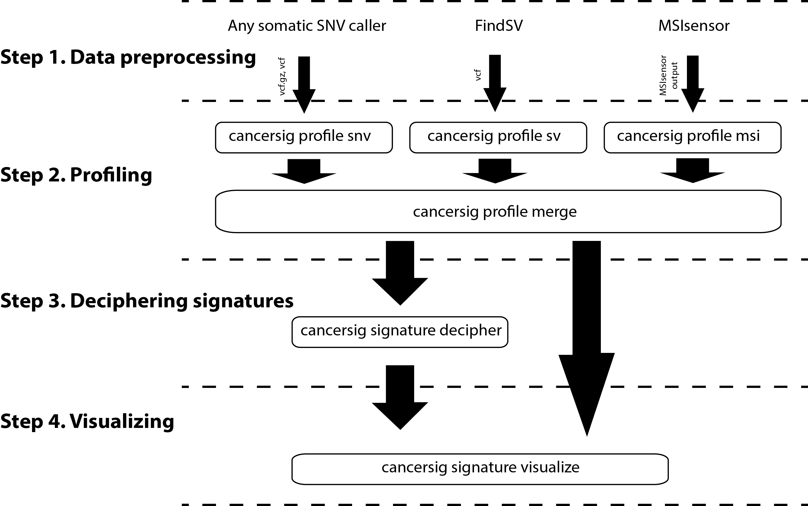

# pyCancerSig
# A python package for deciphering cancer signatures.

Comprehensive cancer signatures with reusable modules written in python, integrating SNV, SV and MSI profiles in signatures decomposed using non-negative matrix factorisation, and produce production ready pdf reports.

## Installation

Dependencies - Currently, feature extraction of structural variants was based on data generated by FindSV and feature extraction of microsatellite instability was based on data generated by MSIsensor
- [FindSV](https://github.com/J35P312/FindSV)
- [MSIsensor](https://github.com/ding-lab/msisensor)
- [samtools](https://samtools.github.io) - used by `cancersig profie snv` for identifying 5' and 3' bases
- [vt](https://genome.sph.umich.edu/wiki/Vt) - used by `cancersig profile snv`

Install the dependencies, then download and install pyCancerSig

```
git clone https://github.com/jessada/pyCancerSig.git
cd pyCancerSig
python setup.py install
echo -e "# set pyCancerSig environment variable\nexport PYCANCERSIG=`pwd`\n" >> ~/.bashrc
source ~/.bashrc      # or logout and re-login
```


## Workflow steps

The workflow consists of 4 steps

<p align="center">
  
</p>

1. Data preprocessing - The purpose of this step is to generate list of variants and/or information related. This step has to be performed by third party software.
    - Single nucleotide variant (SNV) - recommending MuTect2, otherwise Muse, VarScan2, or SomaticSniper.
    - Structural variant (SV) - dependency on FindSV
    - Microsatellite instability (MSI) - dependency on MSIsensor
2. Profiling (Feature extraction) - `cancersig profile` - The purpose of this step is to turn information genereated in the first step into matrix features usable by the model in the next step. The output of this stage has similar format as https://cancer.sanger.ac.uk/cancergenome/assets/signatures_probabilities.txt, which consists of at least 3 columns.
    1. Column 1, Variant type (Substitution Type in COSMIC)
    2. Column 2, Variant subgroup (Trinucleotide in COSMIC)
    3. Column 3, Feature ID (Somatic Mutation Type in COSMIC)
    4. From column 4 onward, each column represent one sample

    There are subcommand to be used for each type of genetic variation
    - `cancersig feature snv` is for extraction single nucletide variant feature
    - `cancersig feature sv` is for extraction structural variant feature
    - `cancersig feature msi` is for extraction microsatellite instability feature
    - `cancersig feature merge` is for merging all feature profiles into one single profile ready to be used by the next step
3. Deciphering mutational signatures - `cancersig signature decipher` - The purpose of this step is to use unsupervised learning model to find mutational signature components in the tumors.
4. Visualizing profiles `cancersig signature visualize` - The purpose of this step is to visualize mutational signature component for each tumor.

## Usage

```
usage: cancersig <command> [options]
```

Key commands:
```
profile             extract mutational profile
signature           decipher mutational cancer signature component and visualization from mutational profiles
```

`cancersig profile` key commands:
```
snv                 extract SNV mutational profile
sv                  extract SV mutational profile
msi                 extract MSI mutational profile
merge               merge all mutaitonal profile into a single profile
```

`cancersig signature` key commands:
```
decipher            perform unsupervised learning model to find mutational signature components
visualize           visualize mutational signatures identified in tumors
```

`cancersig profile snv` [options]:
```
-i {file}           input VCF file (required)
-r {file}           path to genome reference (required)
-o {file}           output snv feature file (required)
--sample_id {id}    a sample id to be used as a column header in the output file (This will replace sample id from vcf header) (optional)
```

`cancersig profile sv` [options]:
```
-i {file}           input VCF file (required)
-o {file}           output sv feature file (required)
--sample_id {id}    a sample id to be used as a column header in the output file (This will replace sample id from vcf header) (optional)
```

`cancersig profile msi` [options]:
```
--raw_msisensor_report {file}    an output from "msisensor msi" that have only msi score (percentage of MSI loci) (required)
--raw_msisensor_somatic {file}   an output from "msisensor msi" that have suffix "_somatic" (required)
--sample_id {id}                 a sample id to be used as a column header in the output file (required)
-o {file}                        output msi feature file (required)
```

`cancersig profile merge` [options]:
```
-i {directories}                 comma-separated directories containing feature files to be merged (required)
-o {file}                        output merged feature file (required)
--profile_types [SV,SNV,MSI]     profile types to be merged, (default: SV,SNV,MSI)
```

`cancersig signature decipher` [options]:
```
--mutation_profiles {file}      input mutation calalog to be deciphered (required)
--min_signatures                minimum number of signatures to be deciphered (default=2)
--max_signatures                maximum number of signatures to be deciphered (default=15)
--out_prefix                    output file prefix (required)
```

`cancersig signature visualize` [options]:
```
--mutation_profiles {file}         input mutation calalog to be reconstructed (required)
--signatures_probabilities {file}  input file with deciphered cancer signatures probabilities (required)
--output_dir {directory)           output directory (required)
```

## Examples and details - Step 1 Data preprocessing

As this part is performed by third-party software, please check the original website for the documentation
- [Single nucleotide variant (SNV)](https://software.broadinstitute.org/gatk/documentation/tooldocs/3.8-0/org_broadinstitute_gatk_tools_walkers_cancer_m2_MuTect2.php)
- [Structural variant (SV)](https://github.com/J35P312/FindSV)
- [Microsatellite instability (MSI)](https://github.com/ding-lab/msisensor)

## Examples and details - Step 2 Profiling (Feature extraction)

###### 2.1 SNV profiling

`cancersig profile snv` will
- scan the VCF (or vcf.gz) file in the genotype field for SNV changes on both strands
- then, use the genomic coordinates to look up the 5\' and 3\' base in the reference fasta (using samtools)
- then, perform SNV profiling of the sample by counting number of SNVs in each category and divide it by total number of variants in the sample.

The sample id in the output feature file will be the same as sample id in the input VCF file.

Example run:
```
cancersig profile snv -i input.vcf.gz -r /path/to/reference.fa -o snv_feature.txt
```

[Example SNV feature output](./cancersig/profile/test/data/snv_profiler/SNVProfiler/test_profile_3/exp_snv_feature.txt) from [Example SNV input.vcf.gz](./cancersig/profile/test/data/snv_profiler/SNVProfiler/test_profile_3/input.vcf.gz)

###### 2.2 SV profiling

`cancersig profile sv` will
- check INFO field "SVTYPE" to determine type of structural variation
- check INFO field "SVLEN" for length of the event
- then, perform SV profiling of the sample by counting number of SVs in each category and divide it by total number of variants in the sample.

The sample id in the output feature file will be the same as sample id in the input VCF file (column 10).

Example run:
```
cancersig profile sv -i gunzip input.vcf -o sv_feature.txt
```

Note: Currently, `cancersig profile sv` only accept uncompressed vcf file

[Example SV feature output](./cancersig/profile/test/data/sv_profiler/SVProfiler/test_profile_1/exp_sv_feature.txt) from [Example SV input.vcf](./cancersig/profile/test/data/sv_profiler/SVProfiler/test_profile_1/input.vcf)

###### 2.3 MSI profiling

`cancersig profile msi` will
- scan for all possible repeat patterns of repeat unit with size between 1-3
- for size between 4-5, just count with no sub-categories
- then, perform MSI profiling of the sample by counting number of repeats in each category and divide it by total number of repeats.

The sample id in the output feature file has to be supplied as an input argument (--sample_id).

Example run:
```
cancersig profile msi --raw_msisensor_report msisensor_out --raw_msisensor_somatic msisensor_out_somatic --sample_id example_sample -o msi_feature.txt
```

[Example MSI feature output](./cancersig/profile/test/data/msi_profiler/MSIProfiler/test_profile_1/exp_msi_feature.txt) from [Example msisensor_out](./cancersig/profile/test/data/msi_profiler/MSIProfiler/test_profile_1/raw_msisensor_out) and [Example msisensor_out_somatic](./cancersig/profile/test/data/msi_profiler/MSIProfiler/test_profile_1/raw_msisensor_out_somatic)

###### 2.4 Merge profile

`cancersig profile merge` will
- scan for \*feature.txt or \*profile.txt files in the input folder(s)
- if a sample has all feature of all mutation types (SNV, SV, MSI), it will be merged into one profile. The percentage weight of SNV, SV and MSI are 70%, 30% and 10% respectively.

Example run:
```
cancersig profile merge -i /path/to/first/dir,/path/to/second/dir -o merged_feature.txt
```
Example run for mergeing certain profile types (SV and SNV in this case):
```
cancersig profile merge -i /path/to/first/dir,/path/to/second/dir -o merged_feature.txt --profile_types SNV,SV
```

[Example merged feature file](./cancersig/profile/test/data/profile_merger/ProfileMerger/test_merge_1/exp_merged_feature.txt) from example input directories -i [/path1](./cancersig/profile/test/data/profile_merger/ProfileMerger/test_merge_1/SNV/cancer1),[/path2](./cancersig/profile/test/data/profile_merger/ProfileMerger/test_merge_1/SNV/cancer2),[/path3](./cancersig/profile/test/data/profile_merger/ProfileMerger/test_merge_1/SV/cancer1),[/path4](./cancersig/profile/test/data/profile_merger/ProfileMerger/test_merge_1/SV/cancer2),[/path5](./cancersig/profile/test/data/profile_merger/ProfileMerger/test_merge_1/MSI/cancer1),[/path6](./cancersig/profile/test/data/profile_merger/ProfileMerger/test_merge_1/MSI/cancer2)

## Examples and details - Step 3 Deciphering mutational signatures

`cancersig signature decipher` will
- load mutational matrix profile
- identify underlying mutational signatures following EXPERIMENTAL PROCEDURES from [Alexandrov et al., Cell Report, 2013](https://www.ncbi.nlm.nih.gov/pmc/articles/PMC3588146/pdf/main.pdf)

Example run:
```
cancersig signature decipher --mutation_profile merged_mutational_profile.txt --out_prefix deciphered_output_file_prefix
```

Example output:
- [Example of signature probabilities (2 signatures)](./example/output_deciphered_2_processes.txt)
- [Example of deciphered signatures (2 signatures)](./example/output_deciphered_2_processes.pdf)
from [Example input mutation_profile](./cancersig/profile/test/data/profile_merger/ProfileMerger/test_merge_1/exp_merged_feature.txt)

## Example and details - Step 4 Visualizing profile

`cancersig signature visualize` will
- display mutational signature composition of the sample
- display the original mutaitonal profile
- display the reconstruction mutational profile (based on the recomposition)
- display the reconstruction error

Example run:
```
cancersig signature visualize --mutation_profile merged_mutational_profile.txt --signatures_probabilities signatures_probabilities.txt --output_dir /path/to/output/dir
```

Example cancersig profile of [sample1](./example/example_sample1_cancersig_profile.pdf),[sample2](./example/example_sample2_cancersig_profile.pdf),[sample3](./example/example_sample3_cancersig_profile.pdf),[sample4](./example/example_sample4_cancersig_profile.pdf) from input [mutation_profile](./cancersig/profile/test/data/profile_merger/ProfileMerger/test_merge_1/exp_merged_feature.txt) and [signatures_probabilities](./example/output_deciphered_2_processes.txt)

## Contact

If you need more information of have any questions, please don't hesitate to contact jessada.thutkawkorapin@ki.se

